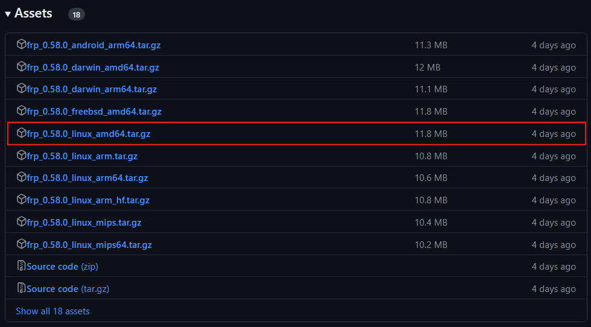

互联网冲浪必须通过公网IP，内网用户的HTTP请求最终还是会由某一个公网IP进行代理，这种技术叫做NAT，NAT的出现是为了缓解IPv4地址缺乏的问题，所以会有很多内网IP公用一个公网IP。在IP协议中，收发方的IP都必须是公网IP，这意味着，在非局域网环境下，我们无法访问处于内网的机器。Frp内网穿透指的是，让我们可以访问到内网中的机器。

由上述可知，使用Frp需要有一个配置了公网IP的服务器，这个可以租国内外的服务器。

## 安装

在Frp仓库的[Release](https://github.com/fatedier/frp/releases)中下载对应的文件。



或者直接使用wget下载：

```bash
wget https://github.com/fatedier/frp/releases/download/v0.58.0/frp_0.58.0_linux_amd64.tar.gz
tar -xvf frp_0.58.0_linux_amd64.tar.gz
```

解压之后，会有这几个文件：

```bash
frpc  frpc.toml  frps  frps.toml  LICENSE
```

其中，frpc和frpc.toml运行在你内网中的服务器上；frps和frps.toml运行在租的云服务器上。

## 配置

### 服务端

```bash
bindPort = 7000

transport.tls.force = true

auth.token = "key"              # 客户端同样需要配置相同的token才能连接服务端

webServer.addr = "0.0.0.0"
webServer.port = 7500
webServer.user = "admin"
webServer.password = "admin"
```

在云服务器上运行服务端：

```bash
./frps -c frps.toml
```

服务端的Frp绑定了本地的7000端口，同时上述配置开启了web界面，可以通过`127.0.0.1:7500`访问web管理界面。

### 客户端

```bash
# frpc.toml
transport.tls.enable = true
serverAddr = "xxx.xxx.xxx.xxx"
serverPort = 7000                               # 公网服务端通信端口

auth.token = "key"                              # 令牌，与公网服务端保持一致

[[proxies]]
name = "web"
type = "tcp"
localIP = "127.0.0.1"                   # 需要暴露的服务的IP
localPort = 1111                                # 将本地1111端口的服务暴露在公网的8080端口
remotePort = 8080                               # 暴露服务的公网入口
```

在内网的机器上运行客户端：

```bash
./frpc -c frpc.toml
```

此时，在浏览器输入`http://<云服务器IP>:8080`，即可以访问到内网服务器上端口为`1111`的服务。

### 遇到的问题

配置文件中ip、token、用户名和密码等，作为字符串必须要使用双引号，否则配置文件解析会出错。

```bash
error unmarshaling JSON: while decoding JSON: json: cannot unmarshal string into Go value of type v1.ServerConfig
```

### 配置HTTPS访问

HTTPS的配置需要申请证书，这就需要一个域名才行了，可以直接Google低价域名，有些商家的低价域名也就10元左右一年，例如[dynadot](https://www.dynadot.com/)，等到期了直接换一个，我们也不是建站，续费是比较贵的。

假设你已经有了域名，我们使用[acme.sh](https://github.com/acmesh-official/acme.sh)来申请域名。TODO

## 原理

TODO
