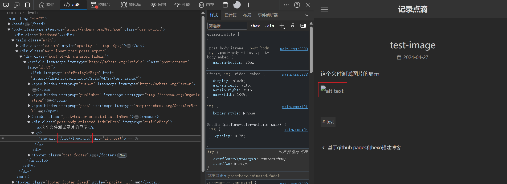
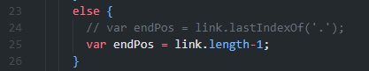
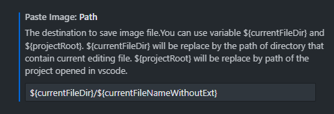

## 本地环境

这部分可以参照Hexo官网的概述部分

- Git：用来推送代码，文章需要在本地编写，然后推送到git仓库
- Node.js：Hexo是基于Node.js的，所以需要安装
- Hexo：使用npm安装Hexo

## 开始搭建

1、首先初始化本地博客

```bash
mkdir <blog-folder>  # 为你的博客创建一个文件夹
cd <blod-folder>
hexo init
```

此时可以使用`hexo new post "hello"`命令来创建一个新的文章，这个文章会出现在`source/_posts`文件夹中，使用命令`hexo generate`可以生成静态资源文件，根目录下会出现`public/`文件夹。然后在命令行中输入如下命令本地测试：

```bash
hexo clean & hexo g & hexo s
```

2、将博客托管到Github Pages

hexo可以帮助我们将markdown文件转化为静态资源文件，而Github Pages则可以将静态资源文件托管。

创建一个github仓库，仓库名必须为`<用户名>.github.io`。进入仓库，在`Setting-Pages`设置`Build and deployment`项为`Github Actions`，让其执行流水线任务。


进入本地博客的根目录，在.github文件夹中创建workflows文件夹，创建文件`page.yml`设定流水线任务，文件内容如下：

```yml
name: Pages

on:
  push:
    branches:
      - main  # 这里的分支名需要确认一下，和远程仓库的分支名要一致

jobs:
  build:
    runs-on: ubuntu-latest
    steps:
      - uses: actions/checkout@v4
        with:
          token: ${{ secrets.GITHUB_TOKEN }}
          # If your repository depends on submodule, please see: https://github.com/actions/checkout
          submodules: recursive
      - name: Use Node.js 20  # 这里的版本号最好和本地Node.js对应
        uses: actions/setup-node@v4
        with:
          # Examples: 20, 18.19, >=16.20.2, lts/Iron, lts/Hydrogen, *, latest, current, node
          # Ref: https://github.com/actions/setup-node#supported-version-syntax
          node-version: '20'
      - name: Cache NPM dependencies
        uses: actions/cache@v4
        with:
          path: node_modules
          key: ${{ runner.OS }}-npm-cache
          restore-keys: |
            ${{ runner.OS }}-npm-cache
      - name: Install Dependencies
        run: npm install
      - name: Build
        run: npm run build
      - name: Upload Pages artifact
        uses: actions/upload-pages-artifact@v3
        with:
          path: ./public
  deploy:
    needs: build
    permissions:
      pages: write
      id-token: write
    environment:
      name: github-pages
      url: ${{ steps.deployment.outputs.page_url }}
    runs-on: ubuntu-latest
    steps:
      - name: Deploy to GitHub Pages
        id: deployment
        uses: actions/deploy-pages@v4
```

然后打开git-bash，输入命令

```bash
git init
git remote add origin git@github.com:zhachery/zhachery.github.io.git  # 更换为你的仓库地址
git add .
git commit -m "hexo init"
git push -u origin master  # 注意分支要对应，如果不对应了可能会失败，根据命令行的提时来改正
```

成功推送之后，可以进入Action里看任务是否执行成功


如果执行成功了，应该就可以前往`https://<你的 GitHub 用户名>.github.io`查看网站了。

## 其他

### 插入图片不显示

首先在博客根目录下执行命令安装图片保存插件

```bash
npm install hexo-asset-image --save
```

修改根目录下的_config.yml文件：

```yaml
post_asset_folder: true  # false改为true
```

这样当使用`hexo new post <title>`时会在_post目录下创建一个同名文件夹，将所要引用的图片保存在该文件夹下，在正文中直接引用时图片的路径为`<当前md文件名-无后缀>/<图片文件名-带后缀>`。

但是hexo-asset-image旧版本有bug，可能导致图片路径有问题而无法显示，如图：



图片的路径包含`.io`或者`.cn`，这是由_config.yml中url地址决定的。回到博客的根目录，找到`/node_modules/hexo-asset-image/index.js`，[修改第24行即可](https://github.com/hexojs/hexo/issues/4492)。



我使用VsCode作为markdown的编辑器，推荐一个插件：Paste Image，然后点击设置。


找到如下设置项，并修改为`${currentFileDir}/${currentFileNameWithoutExt}`：



使用快捷键`Ctrl+Alt+V`可以直接插入剪切板上的图片，并且图片会被自动保存到`<当前md文件名-无后缀>/<图片文件名-带后缀>`，非常方便。如此一来，本地markdown可以实时显示图片，博客静态网页也可以正确渲染图片。

### 主题

Hexo可以选择自己喜欢的主题，可以在官网下载主题，并更换。
